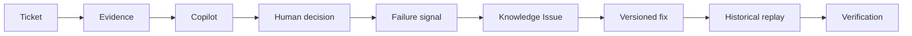
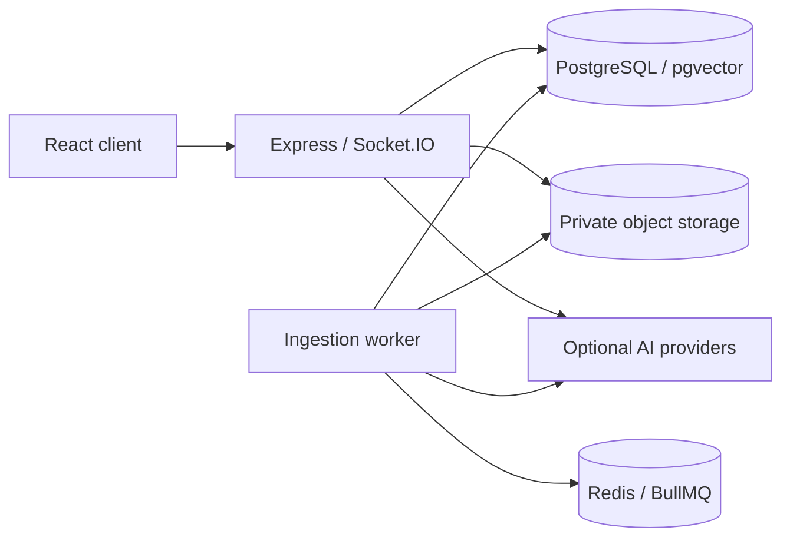

# SupportIQ

An evidence-first multi-tenant customer-support intelligence platform that connects human-reviewed AI replies to versioned knowledge fixes and historical verification.

## Why I built it

Support AI can produce plausible answers from weak or outdated knowledge. A useful system must explain its evidence, retain human decisions, and let a team check whether a knowledge change addressed earlier failures.

## The reliability loop

```mermaid
flowchart LR
  Ticket --> Evidence --> Copilot --> Human[Human decision]
  Human --> Signal[Failure signal] --> Issue[Knowledge Issue]
  Issue --> Version[Versioned fix] --> Replay[Historical replay] --> Verification
```

- Organization-scoped PostgreSQL FTS and pgvector retrieval merge rankings with Reciprocal Rank Fusion. Deterministic evidence policy can abstain before generation.
- Humans explicitly accept, edit or reject a Copilot Run. AI and replay never automatically send customer messages.
- Immutable knowledge versions preserve evidence behind historical runs while replacements prepare separately from the publication.
- Qualifying failures become Knowledge Issues. Source Health distinguishes exposure from attributed failure; rejection alone does not prove a document is wrong.
- Reliability Lab compares historical cases with candidate knowledge and successful guardrails before an issue becomes VERIFIED.
- Object storage, a transactional outbox, BullMQ, processing leases and recovery scans support ingestion through interruptions and duplicate delivery.

## Architecture

```mermaid
flowchart LR
  Client[React client] --> API[Express / Socket.IO]
  API --> PG[(PostgreSQL / pgvector)]
  API --> Storage[(Private object storage)]
  Worker[Ingestion worker] --> PG
  Worker --> Redis[(Redis / BullMQ)]
  Worker --> Storage
  API --> AI[Optional AI providers]
  Worker --> AI
```

API and worker share a modular codebase but run separately. Queue delivery is at least once; database checks fence duplicate and stale work. Read the [architecture](docs/architecture.md), [concurrency boundaries](docs/concurrency.md) and [ten ADRs](docs/adr/README.md).

## Reliability Lab example

The synthetic annual-refund scenario shows six historical failures, a candidate comparison, a published correction, and ten guardrails. Its completed verification reports 6/6 historical failures improved and 10/10 guardrails preserved. These are seeded outcomes, not production accuracy. VERIFIED applies to captured cases and configuration, not all future behavior. See [evaluation methodology](docs/ai-evaluation.md).

## Security and tenancy

Current organization membership and customer ownership control ticket access. Customers cannot access internal notes, staff analytics or private KB administration. Socket delivery rechecks authorization and token expiry. Refresh tokens travel only in cookies; single-use rotation and reuse detection revoke the affected session family. Critical writes use locks and current membership checks. See [claim evidence](docs/readme-claims.md) and the [threat model](docs/threat-model.md) for residual risks.

## Stack and local setup

React, TypeScript, Redux Toolkit Query, Express, Prisma, PostgreSQL/pgvector, Redis/BullMQ, Socket.IO, S3-compatible storage, Jest, Vitest and Playwright. Optional model providers support generation and embeddings; provider-free operation supports lexical retrieval, deterministic gating and a template fallback.

Use Node 22 and pnpm 10. Install with `pnpm install --frozen-lockfile`, configure the per-application environment templates, start isolated Compose services, run `prisma migrate deploy`, and explicitly opt into a disposable demo seed. Start API, worker and client separately. Follow [local development](docs/local-development.md); the seed guard rejects production and remote resets.

## Tests, deployment and demo

[Testing](docs/testing.md) covers policy units, real PostgreSQL/pgvector, Redis/BullMQ, private S3-compatible storage, client interactions and five browser workflows. Live paid providers are excluded from deterministic CI. Client ESLint is configured and checked; API lint remains an explicit placeholder. Typecheck/build success is not an API lint pass.

[Deployment readiness](docs/deployment.md) covers runtime separation, migrations, HTTPS, cookies, origins, storage and release checks. [Ingestion operations](docs/ingestion-operations.md) covers recovery. No deployment is performed automatically.

Follow the [five-minute demo](docs/demo.md). The intentionally public read-only identity is demo.owner@supportiq.app / password123 in seeded environments. Mutable staff fixtures belong only in disposable demonstrations. No public deployment URL is claimed.

## Engineering and learning

- [Authoritative engineering record](docs/repository-reconciliation.md)
- [Final audit](docs/stage-j-audit.md)
- [AI evaluation](docs/ai-evaluation.md), [threat model](docs/threat-model.md) and [ADRs](docs/adr/README.md)
- [Known limitations](docs/known-limitations.md)
- [Interview preparation](docs/interview/README.md)

Multiple API instances require a shared Socket.IO adapter. Uploads have validation and resource bounds but no malware scanner. Synthetic fixtures and human feedback cannot establish universal AI accuracy.
