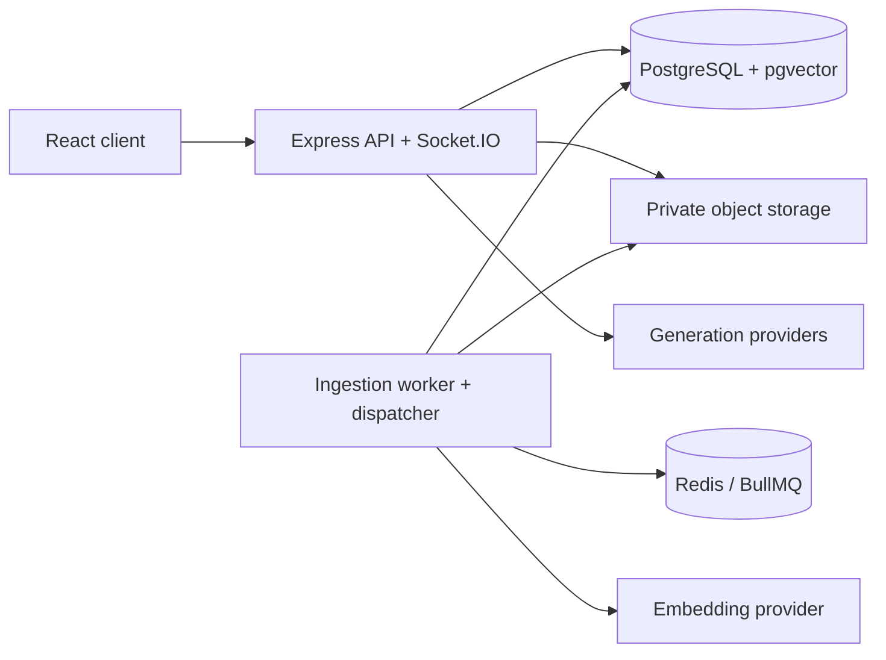
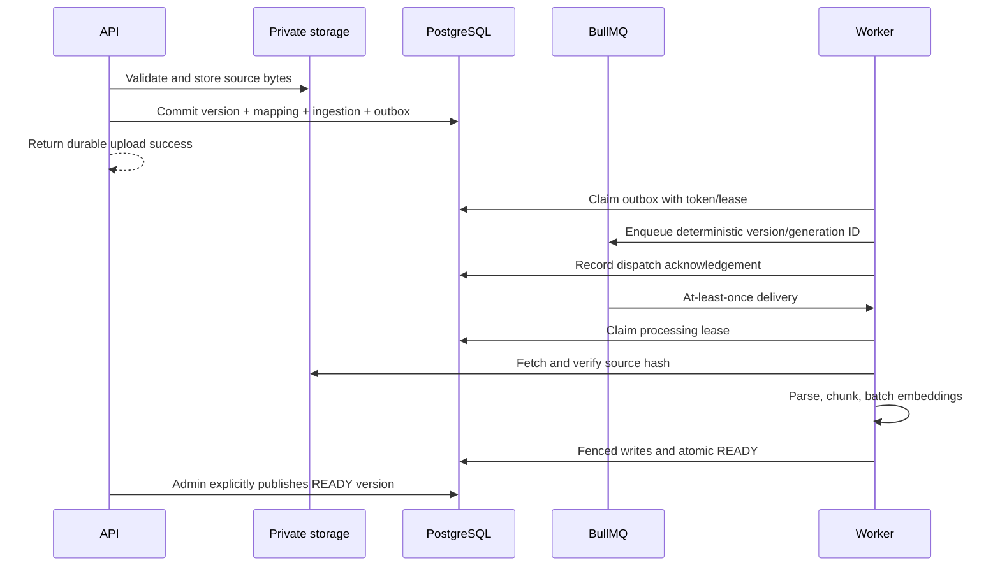

# Architecture

SupportIQ is a modular monolith with a separately started ingestion worker. PostgreSQL owns durable permissions, ticket state, provenance and ingestion correctness. Redis transports work; it is not the authority for completion.

## Reliability loop

```mermaid
flowchart LR
  Ticket --> Retrieval[FTS + optional vector search]
  Retrieval --> Policy[Deterministic evidence policy]
  Policy --> Reply[Suggestion or abstention]
  Reply --> Human[Human decision]
  Human --> Signal[Qualifying failure signal]
  Signal --> Issue[Knowledge Issue]
  Issue --> Version[Immutable candidate version]
  Version --> Replay[Historical replay + guardrails]
  Replay --> Verification[Explicit verification]
```

Generation never sends a message. Copilot send atomically records one decision and the human-approved public message. Replay calls the evaluation core without message side effects. A published version remains available while a replacement is prepared.

## Ingestion sequence

A crash between queue acceptance and acknowledgement can repeat delivery. Database generation/token checks, unique chunk identities and terminal-state no-ops protect correctness. Multiple API instances require a Socket.IO Redis adapter or equivalent shared adapter; adding it does not replace delivery-time authorization.
